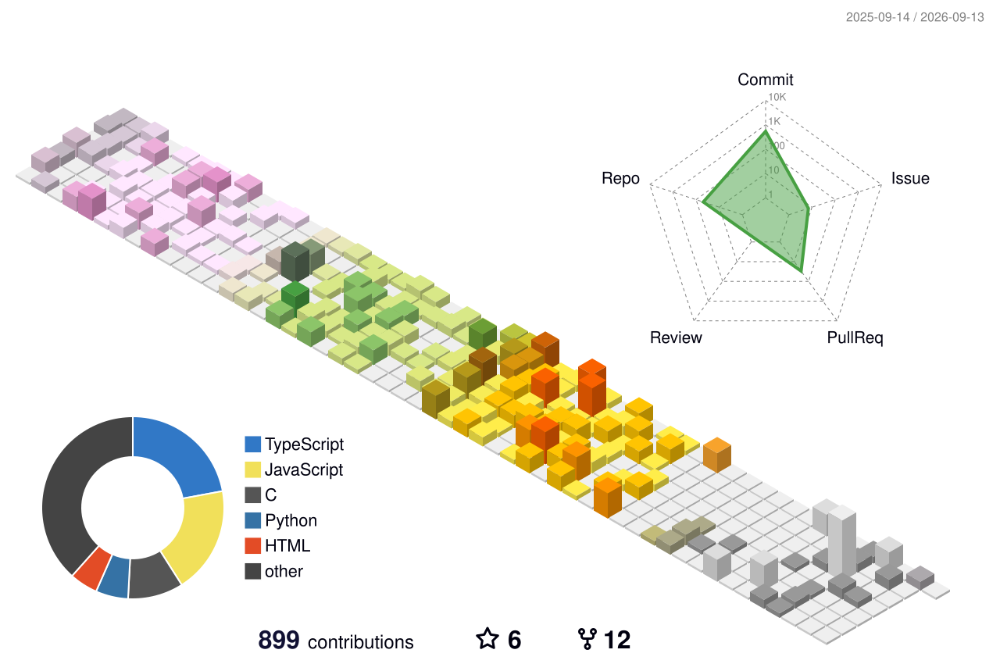

<!-- ═══════════════════════════════════════════════════════════════════════ -->

<!--                              HERO HEADER                                -->

<!-- ═══════════════════════════════════════════════════════════════════════ -->

  

<h3 align="center">
  ⚡ Builder &nbsp;•&nbsp; 🎨 UI/UX Designer &nbsp;•&nbsp; 💻 Full-Stack Developer &nbsp;•&nbsp; ⛓️ Web3 Engineer
</h3>

  <strong>Turning ambitious ideas into real products.</strong> 
  I design, engineer, and ship AI-powered, decentralized, and full-stack experiences.

  
  
  
  

 

  

 

<table align="center">
<tr>
<td align="center" width="180">

### 🏆

**Hackathons**

**5+ Wins**

</td>

<td align="center" width="180">

### 🚀

**Finals**

**16+ Grand Finals**

</td>

<td align="center" width="180">

### 💻

**Focus**

**AI × Web3**

</td>

<td align="center" width="180">

### 🎨

**Craft**

**Design × Code**

</td>
</tr>
</table>

 

  
  

 

  <i>"Don't just learn technology. Build with it."</i>

<!-- ═══════════════════════════════════════════════════════════════════════ -->

<!--                              ABOUT ME                                   -->

<!-- ═══════════════════════════════════════════════════════════════════════ -->

## 🚀 About Me

I'm a **UI/UX Designer, Full-Stack Developer, AI & Web3 Builder** focused on turning ideas into products.

I enjoy working across the entire stack — from **design systems and interactive interfaces** to **APIs, databases, AI agents, smart contracts, and cloud infrastructure**.

My goal is simple:

**Build things that are technically strong, visually exceptional, and genuinely useful.**

---

---
<!-- Fucking most imp part don't touch it -->

# 📊 GitHub Metrics

---

# 🌃 3D Contribution Skyline

🎨 Other Themes

### 🌙 Night Green

---

### 🌆 Night View

---

### 🌿 Green

---

### ✨ Animated Green

---

### 🍂 Season

---

### 🧱 GitBlock

---

### ⚪ Gray

 

---

# 💻 Tech Stack

## 🎨 Design & Prototyping

---

## 🌐 Frontend Development

---

## ⚙️ Backend Development

---

## 🗄️ Databases & Storage

---

## 🤖 AI / Machine Learning

---

## ⛓️ Blockchain & Web3

---

## ☁️ Cloud & DevOps

---

## 🛠️ Development Tools

---

## ⚡ Automation & Productivity

---

## 🖥️ Programming Languages

---

## `🧊 Profile Summary Card`

---

# 🎮 GitHub Breakout

<picture>
  <source media="(prefers-color-scheme: dark)" srcset="./images/breakout-dark.svg">
  
</picture>

---

# 🌐 Connect With Me

---

  

  

