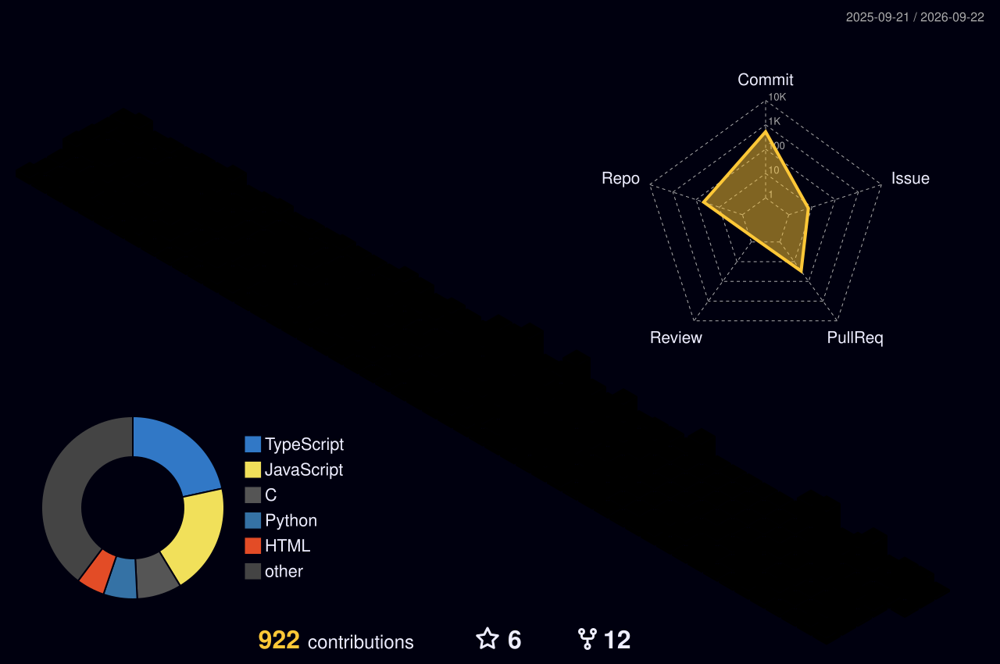
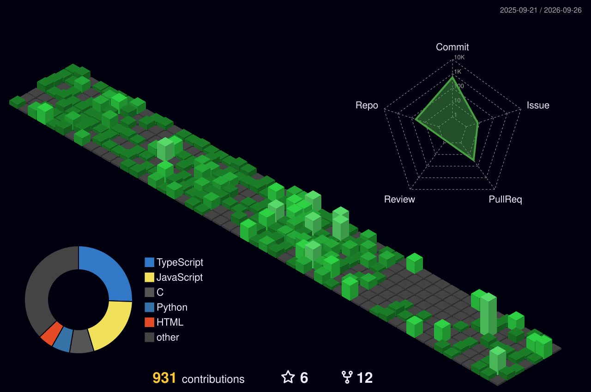
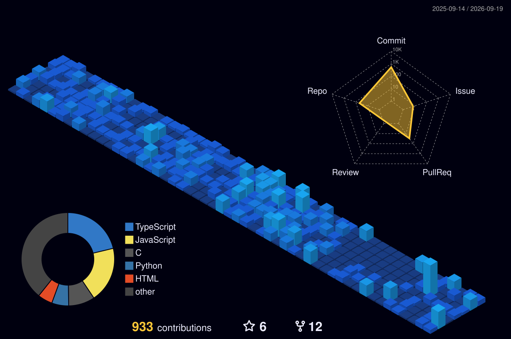
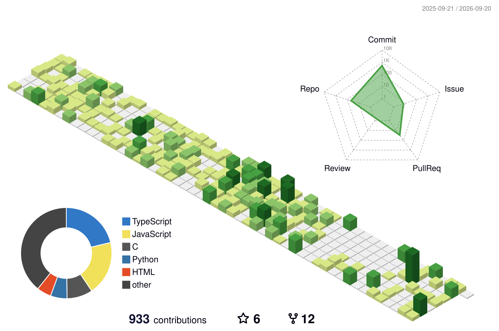
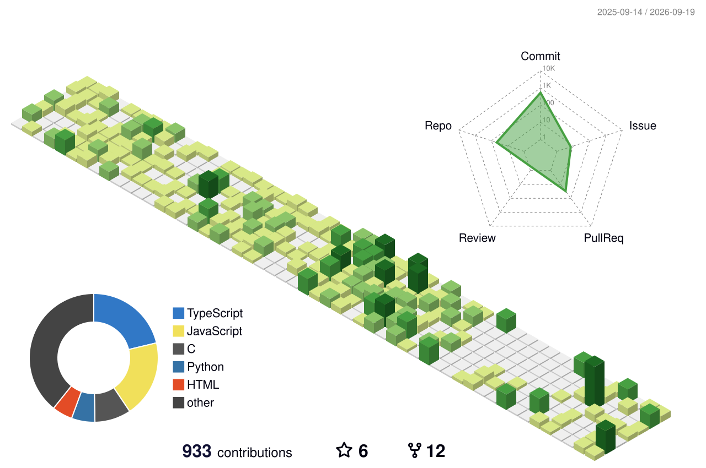
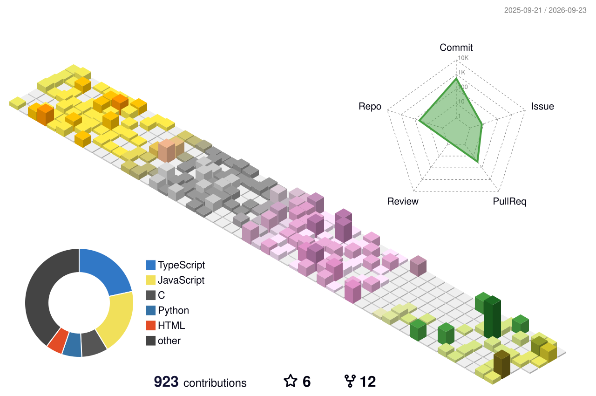
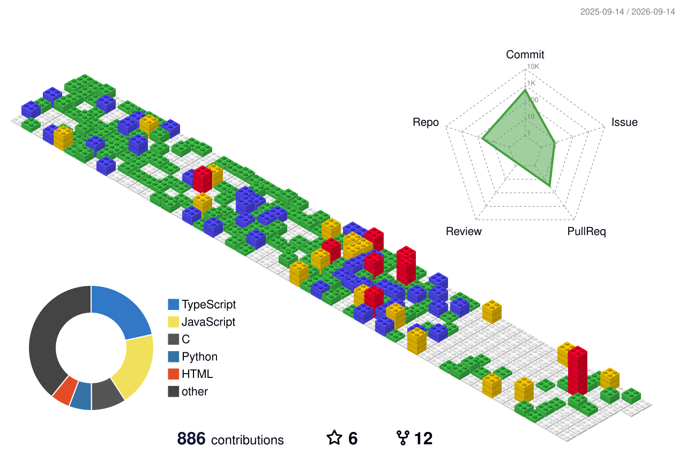
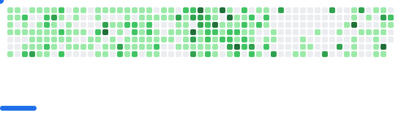

<!-- Banner -->

<h1 align="center">Hi 👋 I'm Parikshit Sharma</h1>

<h3 align="center">
UI/UX Designer • Full-Stack Developer • Web3 Enthusiast • Hackathon Winner
</h3>

Building AI × Web3 × Full-Stack Applications with beautiful user experiences.

---

## 🚀 About Me

	
UI/UX Designer | Full-Stack Developer | AI & Agentic AI Enthusiast | Web3 Builder | Multiple National Hackathon Winner & Finalist | Always building products that solve real-world problems.

---

# 📊 GitHub Metrics

---

# 🌃 3D Contribution Skyline

🎨 Other Themes

### 🌙 Night Green

---

### 🌆 Night View

---

### 🌿 Green

---

### ✨ Animated Green

---

### 🍂 Season

---

### 🧱 GitBlock

---

### ⚪ Gray

 

---

# 💻 Tech Stack

## 🎨 Design & Prototyping

---

## 🌐 Frontend Development

---

## ⚙️ Backend Development

---

## 🗄️ Databases & Storage

---

## 🤖 AI / Machine Learning

---

## ⛓️ Blockchain & Web3

---

## ☁️ Cloud & DevOps

---

## 🛠️ Development Tools

---

## ⚡ Automation & Productivity

---

## 🖥️ Programming Languages

---

# 📈 GitHub Stats

---

# 🎮 GitHub Breakout

<picture>
  <source media="(prefers-color-scheme: dark)" srcset="./images/breakout-dark.svg">
  
</picture>

---

# 🌐 Connect With Me

---

  

  

